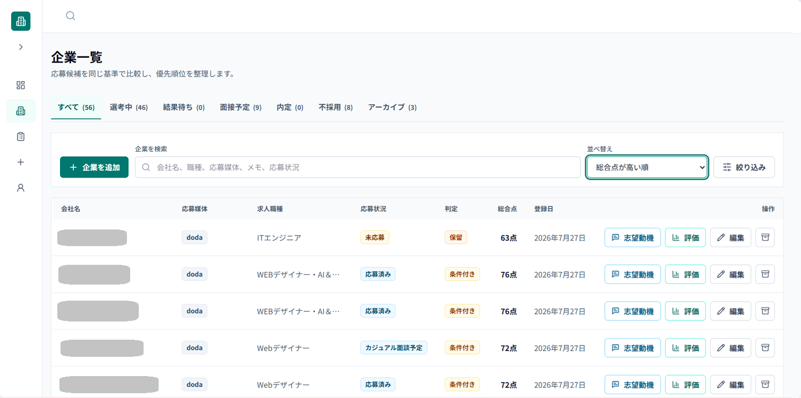

# Career Track

就職活動を効率化するために開発した、企業・応募・面接・企業評価を一元管理できるWebアプリです。



---

## Overview

就職活動では、求人サイト、メール、面接予定などの情報が複数の場所に分散します。

応募企業が増えるにつれて、

- 今どの企業を優先すべきか
- 面接予定はいつだったか
- どの求人サイトから応募したか

といった情報の管理が難しくなりました。

Career Trackは、それらを一つの画面で管理できるようにすることを目的として制作しました。

---

## Features

### 📁 企業管理

- 企業情報の登録・編集
- 重複登録チェック
- アーカイブ機能

### 📝 応募管理

- 応募状況の管理
- 提出期限
- 次回予定
- メモ

### 📊 企業評価

- ルールベースによる企業評価
- 評価理由の表示
- 手動補正

### 🔍 一覧機能

- リアルタイム検索
- 応募媒体フィルター
- 状況フィルター
- 選考状況タブ
- 9種類の並べ替え

### 📱 Responsive

PC・タブレット・スマートフォンに対応

---

## Screenshots

### ダッシュボード

（画像）

### 企業一覧

（画像）

### 企業詳細

（画像）

---

## Development Story

最初は企業情報を登録するだけのシンプルなアプリとして制作しました。

しかし、自分自身の就職活動で実際に使い始めると、

- 企業数が増えて探しづらい
- 不採用企業が邪魔になる
- 面接予定だけ見たい
- 登録したばかりの企業が見つからない

など、多くの改善点が見つかりました。

そこで、実際の運用を通して機能を追加・改善しながら現在の形へ発展させました。

---

## Technical Highlights

### 一貫した状態管理

企業一覧・検索・絞り込み・タブ表示はすべて
`applicationStatus`を基準として管理しています。

### 説明可能な企業評価

企業評価は生成AIではなく、
ルールベースで計算しています。

加点・減点理由を表示し、
利用者が判断できる設計にしました。

### 後方互換性

新機能追加後も既存データをそのまま利用できるよう、
データ移行を必要としない設計としています。

---

## Tech Stack

### Frontend

- React
- TypeScript
- Vite
- Tailwind CSS
- React Router

### Development

- Git
- GitHub
- ESLint
- Visual Studio Code

### Storage

- LocalStorage

---

## AI Usage

生成AIは以下の用途で活用しました。

- 要件整理
- 設計検討
- 実装支援
- リファクタリング
- UI改善
- テスト・レビュー

生成結果をそのまま採用するのではなく、
目的や既存仕様との整合性を確認しながら実装しています。

---

## Roadmap

- [x] 企業管理
- [x] 応募管理
- [x] 選考状況管理
- [x] 企業評価
- [x] 検索・絞り込み・並べ替え
- [ ] Googleログイン
- [ ] Supabaseによるクラウド同期
- [ ] Googleカレンダー連携
- [ ] リマインダー機能

---

## Setup

```bash
git clone https://github.com/ユーザー名/career-track.git

cd career-track

npm install

npm run dev
```

---

## Roadmap

### Phase 1：デザイン方針の再設計

- [ ] アプリ全体のデザインコンセプトを決定
- [ ] 配色・フォント・余白・角丸・影のルールを統一
- [ ] 主要画面のワイヤーフレームを見直し
- [ ] ログイン画面を含めた共通UIを設計

### Phase 2：認証・クラウド対応

- [ ] Supabaseの導入
- [ ] Googleログイン
- [ ] ユーザーごとのデータ管理
- [ ] クラウドへのデータ保存
- [ ] LocalStorageからSupabaseへのデータ移行
- [ ] 複数端末での同期

### Phase 3：UIの実装・仕上げ

- [ ] 新しいデザインを全画面へ反映
- [ ] タブ・メニュー・ステータスにアイコンを追加
- [ ] レスポンシブ表示を再調整
- [ ] ローディング・エラー・空状態を統一
- [ ] アクセシビリティを改善

### Phase 4：Googleカレンダー連携

- [ ] 面接・面談予定をGoogleカレンダーへ追加
- [ ] 面接予定の同期
- [ ] 面接・提出期限のリマインダー

### Phase 5：Gmail連携

- [ ] 面接案内メールの取得
- [ ] メールから日時・企業名・URLを抽出
- [ ] 取り込み候補を確認画面に表示
- [ ] ワンクリックで応募情報を更新

現在は機能面を優先して開発しており、今後は認証・クラウド対応と並行して、アプリ全体のデザインや情報設計も見直す予定です。
